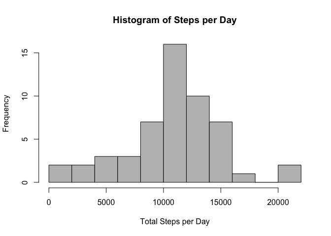
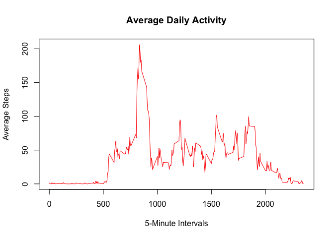
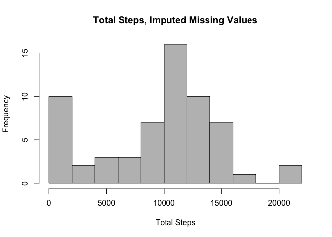
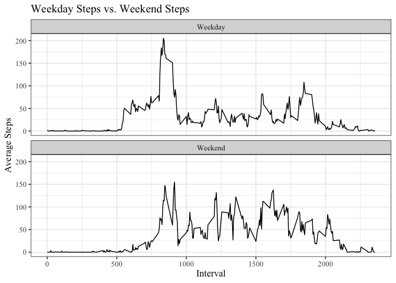

## Load and Preprocess the Data

Start by setting the working directory, then unzip the file and load it in using the `read.table()` function. Then we can see what the data look like using `head()`.


```r
## set the working directory
  setwd("~/Desktop/JHU_certification/repoducible_research/Assignment1")
  
## load the data
  # unzip the file
    unzip("activity.zip")

  # read the data
    file <- "activity.csv"
    act <- read.table(file, sep = ",",
                      header = TRUE)
    head(act)
```

```
##   steps       date interval
## 1    NA 2012-10-01        0
## 2    NA 2012-10-01        5
## 3    NA 2012-10-01       10
## 4    NA 2012-10-01       15
## 5    NA 2012-10-01       20
## 6    NA 2012-10-01       25
```

## What is the mean total number of steps per day?

Start off by chopping out the missing values from the data.


```r
  act_nona <- act[!is.na(act$steps),]
```

Start by loading the dplyr package:


```r
      library(dplyr)
```

Rewrite our data to be grouped by the date variable. Note that we are still using the data with no missing values.


```r
      act_group <- act_nona %>%
        group_by(date) %>%
        summarize(total_steps = sum(steps))
```

```
## `summarise()` ungrouping output (override with `.groups` argument)
```

Now we are going to make a **histogram** from this summarized data using the base plotting system.  


```r
  hist_steps <- hist(act_group$total_steps,
                     col = "grey",
                     main = "Histogram of Steps per Day",
                     xlab = "Total Steps per Day",
                     breaks = 10)
```

<!-- -->

Now to calculate the **mean** and **median**. Remember that this data lacks any NA values for the step variable. 


```r
  (mean_steps <- mean(act_group$total_steps))
```

```
## [1] 10766.19
```

```r
  (median_steps <- median(act_group$total_steps))
```

```
## [1] 10765
```

## What is the average daily activity pattern?

Our first goal is to make a time series plot of the 5-minute interval (x-axis) and the average number of steps taken, averaged across all days. To do this, we must first group the data by interval and create the average steps per interval value.


```r
  act_day <- act_nona %>%
    group_by(interval) %>%
    summarize(avg_steps = mean(steps))
```

```
## `summarise()` ungrouping output (override with `.groups` argument)
```

Now we can create our plot! We will have intervals on the x-axis and average steps on the y-axis.


```r
  avg_step <- plot(x = act_day$interval,
                   y = act_day$avg_steps,
                   type ="l", col = "red",
                   main = "Average Daily Activity",
                   ylab = "Average Steps",
                   xlab = "5-Minute Intervals")
```

<!-- -->

Now to calculate the maximum interval:


```r
    as.numeric(act_day[act_day$avg_steps==max(act_day$avg_steps), 1])
```

```
## [1] 835
```

## Imputing missing values

Let's start by reporting all the missing values in the original data set:


```r
    sum(is.na(act$steps))
```

```
## [1] 2304
```

Now to impute our missing values. The most reasonable option is to take the **median** for the given interval, this way we avoid the influence of outliers when doing any further analyses.


```r
## impute the missing values: median value per interval
  act_imp <- act
    for (x in unique(act$interval)) {
      avg <- median(act_nona$steps[act_nona$interval==x])
        act_imp[is.na(act$steps) & act$interval==x,1] <- avg
    }
```

Now to create our second steps per day histogram, this time with imputed values in the place of our missing values from the first histogram.


```r
  ## first group up our variables
    imp_group <- act_imp %>%
      group_by(date) %>%
      summarize(total_steps = sum(steps))
```

```
## `summarise()` ungrouping output (override with `.groups` argument)
```

```r
  ## create the histogram
    imp_hist <- hist(imp_group$total_steps,
                     main = "Total Steps, Imputed Missing Values",
                     xlab = "Total Steps",
                     breaks = 10, col = "grey")
```

<!-- -->

Because I elected to use the *median* value for the NA observations, we see a great increase in the number of observations with a value of zero. If I had imputed the values using the *mean* instead the number of zeroes would likely be lower, with a likelihood of many lower, non-zero, values.

## Are there differences in activity patterns between weekdays and weekends?

In order to determine if there are any differences between weekdays and weekends, we must first generate a factor variable equal to "Weekend" if the day falls on either Saturday or Sunday and "Weekday" otherwise.


```r
### create a new factor variable, weekday
  ## convert the date variable to date format
    act_imp$date <- as.Date(act_imp$date)
  
  ## set up day variable
    act_imp$day <- weekdays(act_imp$date)

  ## create a weekday variable from that
    week <- c("Monday", "Tuesday", "Wednesday", "Thursday", "Friday")
      act_imp$weekday <- if_else(act_imp$day %in% week, 
                                 "Weekday",
                                 "Weekend")
  ## convert to factor  
    act_imp$weekday <- as.factor(act_imp$weekday)
```

Now that we have our the weekday variable, we must group the data by interval and our new factor variable.


```r
    imp_day <- act_imp %>%
      group_by(interval, weekday) %>%
      summarize(avg_step = mean(steps))
```

```
## `summarise()` regrouping output by 'interval' (override with `.groups` argument)
```

From here, all we need to do is graph it using the ggplot2 package. I find this system is simpler than the base package for faceting by a factor variable.


```r
  ## load the ggplot package   
    library(ggplot2)
    
  ## make a facet wrapped graph
    (imp_line <- ggplot(imp_day) +
      geom_line(aes(x = interval, y = avg_step)) +
      facet_wrap(weekday ~ ., nrow = 2) +
      theme_bw(base_family = "Times New Roman",
               base_size = 12) +
      labs(title = "Weekday Steps vs. Weekend Steps",
           x = "Interval", y = "Average Steps"))
```

<!-- -->
